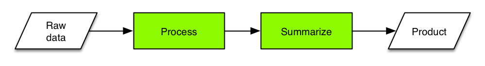
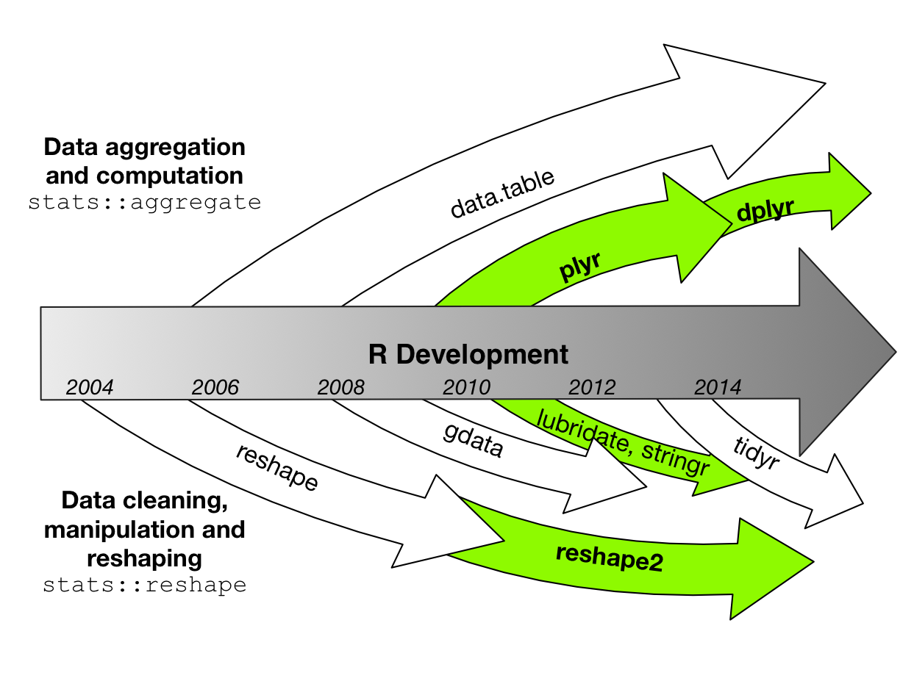

Working with data in R
========================================================
author: Ben Bond-Lamberty
date: June 2015

A JGCRI workshop covering reproducibility, tools, importing, manipulation and aggregation, piping, handling errors, speed (profiling, parallelization), and common use cases.

Three hours, 50% lecture and 50% working examples and problems.

Feedback: <a href="mailto:bondlamberty@pnnl">Email</a>  [Twitter](https://twitter.com/BenBondLamberty)


Focus of this workshop
========================================================



In a typical data pipline:
- *Raw data* can come from many sources 
- *Processing* includes cleaning, filtering, reshaping, modifying, QC
- *Summarizing* includes applying functions, merging with ancillary data, computing group summaries
- *Products* include output data, plots, statistical analyses


Is R the right tool for the job?
========================================================

>R has simple and obvious appeal. Through R, you can sift through complex data sets, manipulate data through sophisticated modeling functions, and create sleek graphics to represent the numbers, in just a few lines of code...
>
>R’s greatest asset is the vibrant ecosystem has developed around it: The R community is constantly adding new packages and features to its already rich function sets. It’s estimated that more than 2 million people use R...

From [The 9 Best Languages For Crunching Data](http://www.fastcompany.com/3030716/the-9-best-languages-for-crunching-data)


Is R the right tool for the job?
========================================================

It might not be. R has limitations and weaknesses:
- nontrivial learning curve; quirks; inconsistent syntax
- documentation patchy and terse
- package quality varies
- generally operates in-memory only
- not particularly fast

Alternatives to address some of these issues include C/C++ (speed), Python (intuitive, flexible, scalable), Julia (fast, expressive, arcane), Java (scalable), Hadoop (very large data).


Things you should know
========================================================
type: section


Things you should know: basics
========================================================

This workshop assumes you understand the basics of using R:

- What it is
- How to start it
- The idea of *objects*, *functions*, *assignment*, and *comments*

```r
x <- 10
sum(x) # `sum` is a built-in function
```

```
[1] 10
```
- How to get help: for example `?read.table`

Things you should know: data types
========================================================

- The *boolean* (`TRUE`, `FALSE`) data type
- The *vector* data type

```r
v <- 1:5
cat(v, v*2)
```

```
1 2 3 4 5 2 4 6 8 10
```

```r
c(sum(v), rev(v))  # concatenate
```

```
[1] 15  5  4  3  2  1
```


Things you should know: data types
========================================================

- The *factor* data type

```r
summary(letters)
```

```
   Length     Class      Mode 
       26 character character 
```

```r
summary(as.factor(letters))
```

```
a b c d e f g h i j k l m n o p q r s t u v w x y z 
1 1 1 1 1 1 1 1 1 1 1 1 1 1 1 1 1 1 1 1 1 1 1 1 1 1 
```


Things you should know: data frames
========================================================

- The idea of a *data frame* (tightly coupled vectors)

```r
head(cars)  # a built-in dataset
```

```
  speed dist
1     4    2
2     4   10
3     7    4
4     7   22
5     8   16
6     9   10
```
Data frames are the fundamental (in the sense of most frequently used) data type in R.


Things you should know: data frames
========================================================

- How to get information about a data frame

```r
nrow(cars)
```

```
[1] 50
```

```r
summary(cars)
```

```
     speed           dist       
 Min.   : 4.0   Min.   :  2.00  
 1st Qu.:12.0   1st Qu.: 26.00  
 Median :15.0   Median : 36.00  
 Mean   :15.4   Mean   : 42.98  
 3rd Qu.:19.0   3rd Qu.: 56.00  
 Max.   :25.0   Max.   :120.00  
```


Things you should know: data frames
========================================================

- Basic data frame indexing

```r
cars[1,]
```

```
  speed dist
1     4    2
```

```r
cars[c(1, 3:4),]
```

```
  speed dist
1     4    2
3     7    4
4     7   22
```

***


```r
# Rows and columns can be specified by number or name.
cars[3, "dist"]
```

```
[1] 4
```

```r
cars$dist[3]
```

```
[1] 4
```


Gotcha #1: partial matching
========================================================
type: alert

R has *partial matching* for the $ operator.


```r
d <- data.frame(xdsfjk=1:3)
d$x
```

```
[1] 1 2 3
```

In particular, you need to be careful using any `x`, or checking for `is.null(x)`, if another column exists whose name begins with the same pattern.

This applies to both data frames and lists.


Things you should know: control flow
========================================================

- Most common control flow uses `if...then...else` and `for`

```r
if(sum(1:4) == 10) {
  print("right!")
} else {
  print("wrong!")
}
```

```
[1] "right!"
```

```r
for(i in 1:4) { cat(i) }
```

```
1234
```


Things you should know: control flow
========================================================

The difference between a *script* and *command line*.

In general, you want to use scripts.


Things you should know: packages
========================================================

- *Packages* are pieces of software that can be optionally loaded and used. The package system is one of R's enormous strengths: there are thousands, written for all kinds of tasks and needs.


```r
library(ggplot2)
qplot(speed, dist, data=cars)
```

***

 


Quiz: Basics
========================================================
type: prompt
incremental: true


```r
x <- -2:2
x ** 2  # what does this print?
```

```
[1] 4 1 0 1 4
```

```r
y <- x < 0  # what type is y?
y
```

```
[1]  TRUE  TRUE FALSE FALSE FALSE
```

***


```r
x[-1] # ?
```

```
[1] -1  0  1  2
```

```r
data.frame(x=x, y=y)
```

```
   x     y
1 -2  TRUE
2 -1  TRUE
3  0 FALSE
4  1 FALSE
5  2 FALSE
```


Reproducibility
========================================================
type: section


Reproducibility
========================================================

We are in the era of 'big data', but even if you work with 'little data' you have to acquire some skills to deal with those data.

**Most fundamentally, your results have to be reproducible.**

**Reproducible by yourself, and others.**

**At any time in the future.**


You can't reproduce
========================================================
...what doesn't exist.
- Gozilla ate my computer
    + backup
    + ideally *continuous*
- Godzilla ate my office
    + cloud

***


You can't reproduce
========================================================

...what you've lost. What if you need access to a file as it existed 1, 10, or 100, or 1000 days ago?
- Incremental backups
    - minimum
- Version control
    - better

***


Version control
========================================================

**Git** and **GitHub** are the most popular (and free) version control tools for use with R, and many other languages:
- version control
- sharing code with collaborators
- issue tracking
- social coding

***


**JGCRI has a paid GitHub account: private repositories.**


Packages and reproducibility
========================================================

Using *packages* raises an interesting problem though, as the packages may themselves
change over time (version 1.0, 1.1, ...). How can you guarantee that your script's
behavior and results won't change?

There are a number of solutions to this problem, but my favorite lightweight one is the [checkpoint](http://cran.r-project.org/web/packages/checkpoint/index.html) package.


```r
library(checkpoint)
checkpoint("2015-06-20")
```

This will automatically load and install your script's packages *exactly as they existed on a particular date in the past*.


Code style and clarity
========================================================

Use a clear, consistent code style. Many examples are available.

Be clear in your code.


```r
finaldata <- plot(merge(process(read.csv( "rawdata.csv")), otherdata))
```


```r
finaldata <- read.csv("rawdata.csv") %>%
  process() %>%
  merge(otherdata) %>%
  plot()
```


Reproducible research example
========================================================

A typical project/paper directory for me:
```
0-download.R
1-process_data.R
2-analyze_data.R
3-make_graphs.R
logs/
output/
rawdata/
```

This directory is generated by my [default script](https://github.com/bpbond/R_analysis_script). It is backed up both *locally* and *remotely*, and under *version control*.


Reproducible research example
========================================================

- Sequentially numbered R scripts
    + (0-download.R, 1-process_data.R, ...)
- Each script depends on the previous one
- Each has a discrete, logical function
- Each produces a *log file*
    + including date/time, what R version, etc.
- This analytical chain starts with raw data
- ...and ends with figures and tables for ms
    + *or the ms itself!*


Getting data into R
========================================================
type: section


Things to install beforehand
========================================================
If you're doing the exercises and problems, you should have installed these
packages beforehand:
- `dplyr` - fast, flexible tool for working with data frames
- `plyr` - tools for splitting, applying and combining data
- `reshape2` and `tidyr` - reshaping and tidying data

We'll also use these *data packages*:
- `babynames` - names provide to the SSA 1880-2013
- `nycflights13` - 336,776 flights that departed NYC in 2013

These can all be installed using R's `install.packages` command.


Getting data into R
========================================================

By far the most common way to bring data into R is via the `read.table` family of functions. In particular, `read.csv` reads a comma separated value file.

```r
d <- read.table("mydata.csv", sep=",", header=TRUE)
d <- read.csv("mydata.csv") # same thing
```


Getting data into R
========================================================

Common and useful options to `read.table` and its brethren include:

Option        | Effect
------------- | -------------
skip=*n*      | Skip the first *n* lines of the file
nrows=*n*     | Read *n* rows of data
sep=*s*       | Look for character *s* separating data
comment.char=*c*  | Lines beginning with *c* are ignored
header=TRUE  | Look for a header giving column names
check.names=TRUE | Check that column names are syntactically correct


Gotcha #2: stringsAsFactors
========================================================
type: alert

The behavior of `read.table` leads to an **extremely common** bug for beginners in R.

By default, `read.table` changes strings to `factors`: a number encoding categories (e.g. 0, 1, 2 instead of "Apple", "Banana", "Grape"). This can lead to hard-to-diagnose problems later if you're not expecting it.

The solution:

```r
d <- read.csv("mydata.csv", stringsAsFactors=FALSE)
```


Getting data into R
========================================================

`read.table` can also read from data you've copied from another program, from a string, from a compressed file, or from an URL.

Let's use this ability to read in a dataset, from Pew Research's [Religious Landscape Survey](http://www.pewforum.org/religious-landscape-study/). These particular data examine the relationship between income and religious affiliation.

***


Exercise: Reading data into R
========================================================
type: prompt
incremental: true

Data are at: http://stat405.had.co.nz/data/pew.txt


```r
pew <- read.table(...) # or...?
pew
summary(pew)
```

Don't forget to look at the help page!


```r
pew <- read.table(
  file = "http://stat405.had.co.nz/data/pew.txt",
  header = TRUE,
  stringsAsFactors = FALSE,
  check.names = FALSE
)
```


Alternatives for getting data into R
========================================================

The `read.table` family of functions can be slow and (generally) only read from flat text files. But there are *many* other options.
- A number of packages read Excel files directly. In particular the new `readxl` is fast, stable, and flexible
- `data.table::fread` reads text files extremely quickly, as does the new `readr` package
- The `foreign` package provides import facilities for Stat, SAS, Minitab, etc.
- Relational databases via ` RMySQL` and others
- Many specialized packages (e.g. `ncdf4` for netCDF, `XML::readHTMLTable` for extracting tables from HTML)


Cleaning data
========================================================
type: section


Examining data frames
========================================================

In most cases, after you've imported your data, it's in a `data.frame`. The `summary` and `str` functions are useful for at this point:

```r
str(cars); summary(cars)
```

```
'data.frame':	50 obs. of  2 variables:
 $ speed: num  4 4 7 7 8 9 10 10 10 11 ...
 $ dist : num  2 10 4 22 16 10 18 26 34 17 ...
```

```
     speed           dist       
 Min.   : 4.0   Min.   :  2.00  
 1st Qu.:12.0   1st Qu.: 26.00  
 Median :15.0   Median : 36.00  
 Mean   :15.4   Mean   : 42.98  
 3rd Qu.:19.0   3rd Qu.: 56.00  
 Max.   :25.0   Max.   :120.00  
```

Examining data frames
========================================================


```r
nrow(cars)
```

```
[1] 50
```

```r
head(cars)
```

```
  speed dist
1     4    2
2     4   10
3     7    4
4     7   22
5     8   16
6     9   10
```

***


```r
ncol(cars)
```

```
[1] 2
```

```r
tail(cars)
```

```
   speed dist
45    23   54
46    24   70
47    24   92
48    24   93
49    24  120
50    25   85
```


Examining data frames
========================================================

For very large data frames, you might want to take a random sample of the rows to be able to plot or get a sense of things.

```r
library(babynames) # has 1,792,091 rows
babynames[sample(nrow(babynames), 3), ]
```

```
        year sex      name  n         prop
1450984 2003   M Tyquavion  7 3.334502e-06
1747304 2012   M     Javan 50 2.475919e-05
673911  1968   F Bernadett 12 7.020089e-06
```
This uses the extremely useful function `sample` to randomly sample from a vector.


Examining data frames
========================================================


```r
names(cars)
```

```
[1] "speed" "dist" 
```

```r
unique(cars$speed)
```

```
 [1]  4  7  8  9 10 11 12 13 14 15 16 17 18 19 20 22 23 24 25
```

***


```r
range(cars$dist)
```

```
[1]   2 120
```


Subsetting data frames
========================================================

There are (at least) two separate ways to subset data in base R.


```r
cars[cars$speed < 8,]
```

```
  speed dist
1     4    2
2     4   10
3     7    4
4     7   22
```

***


```r
subset(cars, speed < 8)
```

```
  speed dist
1     4    2
2     4   10
3     7    4
4     7   22
```
There can be subtle differences but you can generally consider these to be equivalent.


Subsetting data frames
========================================================

Data frames are indexed by row *first* and column *second* (in the more general case of multidimensional arrays, the other dimensions follow).

```r
cars[1, ]
```

```
  speed dist
1     4    2
```

***


```r
cars[1:3, ]
```

```
  speed dist
1     4    2
2     4   10
3     7    4
```

Negative notation excludes!


```r
cars[2, -1] 
```

```
[1] 10
```


Subsetting data frames
========================================================

Finding and removing duplicates. Note the use of `which`.

```r
any(duplicated(cars$dist))
```

```
[1] TRUE
```

```r
dupes <- which(duplicated(cars$dist))
print(dupes)
```

```
 [1]  6 15 16 17 18 20 24 25 29 30 36 37 39 42 45
```

```r
cars_nodupes <- cars[-dupes, ]
```


Examining data frames
========================================================


```r
plot(cars$speed, cars$dist, main="We are NOT covering plotting!")
```

 


Exercise: Examining data frames
========================================================
type: prompt


```r
library(babynames)
summary(babynames)
```

How many rows and columns are there in the `babynames` dataset?

What name is in row #12345?

How many unique baby names are there?

Make a new data frame with a random 1% of the original rows.

How many 19th century rows are there?


Exercise: Examining data frames
========================================================
type: prompt


```r
library(babynames)
cat(nrow(babynames), ncol(babynames), babynames[12345, "name"])
```

```
1792091 5 Baxter
```

```r
s <- babynames[sample(1:nrow(babynames), 0.01 * nrow(babynames)),]

sum(babynames$year < 1900) # better than nrow(subset(...))
```

```
[1] 52265
```


Cleaning data
========================================================

Usually, the first thing you'd like to do after importing data is *clean* it.

- change column types
- computing on columns
- splitting columns
- combining columns
- dealing with `NA` values


Changing column types
========================================================

Often, the default classes assigned by `read.table` and its ilk aren't correct. You can change these--but first, make sure to understand *why* `read.table` did what it did.

```r
d$x <- as.numeric(d$x)
d$y <- as.character(d$y)
d$z <- as.Date(d$z)
d$z <- as.factor(d$x)
```


Computing on columns
========================================================

This can be simple...

```r
d <- data.frame(x=1:3)
d$y <- d$x * 2
d$z <- cumsum(d$y)
d$four <- ifelse(d$y == 4, "four", "not four") 
d
```

```
  x y  z     four
1 1 2  2 not four
2 2 4  6     four
3 3 6 12 not four
```

R provides a set of high performance functions for many of these tasks: `cumsum`, `cumprod`, `colMeans`, `colSums`, `rowMeans`, `rowSums`, etc.


Computing on columns
========================================================

...but not always. A rolling mean for window size *n*, for example.

* naive (slow) loop

```r
for(i in seq_along(x)) {
  # calculate mean...
```
* `filter` (note its `sides` argument)

```r
stats::filter(x, rep(1/n, n), sides=2)
```

* package-specific solutions, e.g.

```r
zoo::rollmean(x, n, align='center')
```


Gotcha #3: sequences and for()
========================================================
type: alert

In the previous example, we used `seq_along(x)` instead of `1:length(x)` (or `nrow`). Why?

Because if `d` has zero rows or elements...


```r
d <- data.frame()  # 0 rows
for(i in 1:nrow(d)) print(i)
```

```
[1] 1
[1] 0
```

```r
for(i in seq_along(d))    # correct: no output
  print(i) 
```


Exercise: Computing on columns
========================================================
type: prompt
incremental: true

One recent problem I had involved a data frame with multiplexer valve numbers; in the experiment, the multiplexer was automatically switching between valves.

Whenever the valve number changes, we want to assign a new sample number.

```r
# analyzer is switching between valves 1, 2, and 3
vnums <- c(1, 1, 2, 3, 3, 3, 1, 2, 2, 3)
# there are 6 samples here: (1, 1), (2), (3, 3, 3), (1), (2, 2), (3)

# There are ≥ two solutions
# One is slow and functional, one fast and elegant
```


Exercise: Computing on columns
========================================================
type: prompt
incremental: true


```r
samplenums <- rep(1, length(vnums))
s <- 1
for(i in seq_along(vnums)[-1]) {
  if(vnums[i] != vnums[i-1])
    s <- s + 1
  samplenums[i] <- s
}
samplenums
```

```
 [1] 1 1 2 3 3 3 4 5 5 6
```


```r
newvalve <- c(TRUE, vnums[-length(vnums)] != vnums[-1])
cumsum(newvalve)
```

```
 [1] 1 1 2 3 3 3 4 5 5 6
```


Exercise: Computing on columns - time
========================================================
type: prompt


This has big consequences!

For a data frame with 1,100,000 rows:

***

 


Combining columns
========================================================

Combining columns is generally easy.

```r
d <- data.frame(x=1:3, y=4:6)
d$z <- with(d, paste("pasted", x, "and", y))  # note use of `with` here
d
```

```
  x y              z
1 1 4 pasted 1 and 4
2 2 5 pasted 2 and 5
3 3 6 pasted 3 and 6
```


Splitting columns
========================================================

This is sometimes a bit trickier. Perfectly possible in base R, but since we'll be using the `reshape2` package later anyway, let's use `reshape2::colsplit`.

```r
d <- data.frame(x=paste("hi", 1:3))
library(reshape2)
split <- colsplit(d$x, " ", c("var1", "var2"))
cbind(d, split)
```

```
     x var1 var2
1 hi 1   hi    1
2 hi 2   hi    2
3 hi 3   hi    3
```


Understanding and dealing with NA
========================================================

One of R's real strengths is that missing values are a first-class data type: `NA`.


```r
x <- c(1, 2, 3, NA)
is.na(x) # returns c(F, F, F, T)
any(is.na(x)) # returns TRUE
```

Like `NaN` and `Inf`, usually `NA` 'poisons' operations, so must be handled.


```r
sum(x) # NA
sum(x, na.rm=TRUE) # 6
d <- data.frame(x)
na.omit(d)  # remove rows with NA
complete.cases(d)  # identify 'good' rows
```


Dealing with dates
========================================================

R has a `Date` class representing calendar dates, and an `as.Date` function for converting to Dates. The `lubridate` package is often useful (and easier) for these cases:

```r
library(lubridate)
x <- c("09-01-01", "09-01-02")
ymd(x)   # there's also dmy and mdy!
```

```
[1] "2009-01-01 UTC" "2009-01-02 UTC"
```

The `difftime` function is useful for computing time intervals.


Quiz: Cleaning Data
========================================================
type: prompt
incremental: true


```r
x <- -2:2
y <- 4/x 
y  # prints...?
```

```
[1]  -2  -4 Inf   4   2
```

```r
y <- y[is.finite(y)]
y  # prints...?
```

```
[1] -2 -4  4  2
```

***


```r
is.numeric(NA)
```

```
[1] FALSE
```

```r
is.numeric(Inf)
```

```
[1] TRUE
```

```r
is.infinite(Inf)
```

```
[1] TRUE
```


Reshaping data
========================================================
type: section


History lesson
========================================================




Reshaping data
========================================================

We often need data in a particular form for working with it.

If you're used to spreadsheets, it's more common to use data in *wide format*: a subject's repeated responses are in a single row.

For data processing in R, *wide format* is almost always better: each row is one time point per subject.

Variables are one of two types: `id` variables, which are typically assigned; and `measure` variables, which are measured (observations). But it's not always obvious
- What is a variable?
- What is a unit of observation?
- Which data should go in each row?


Reshaping the Pew data
========================================================


```r
pew[1:5, 1:4]
```

```
            religion <$10k $10-20k $20-30k
1           Agnostic    27      34      60
2            Atheist    12      27      37
3           Buddhist    27      21      30
4           Catholic   418     617     732
5 Don’t know/refused    15      14      15
```

These data are *wide* - multiple observations per row.

Which columns are *measure* variables, and which *id* variables?


Reshaping the Pew data
========================================================


```r
pew_long <- melt(pew, id.vars="religion")
head(pew_long)
```

```
            religion variable value
1           Agnostic    <$10k    27
2            Atheist    <$10k    12
3           Buddhist    <$10k    27
4           Catholic    <$10k   418
5 Don’t know/refused    <$10k    15
6   Evangelical Prot    <$10k   575
```

These data are now *long*.


Exercise: Reshaping data
========================================================
type: prompt
incremental: true

?


Summarizing and operating on data
========================================================
type: section


Summarizing and operating on data
========================================================

Intro - typical kinds of tasks


The apply family
========================================================

Traditionally the *apply* family of functions was R's solution. 

Function      | Description
------------- | ------------
base::apply   |  Apply Functions Over Array Margins
base::by      |  Apply a Function to a Data Frame Split by Factors
base::eapply  |  Apply a Function Over Values in an Environment
base::lapply  |  Apply a Function over a List or Vector
base::mapply  |  Apply a Function to Multiple List or Vector Arguments
base::rapply  |  Recursively Apply a Function to a List
base::tapply  |  Apply a Function Over a Ragged Array

This table is copied from https://nsaunders.wordpress.com/2010/08/20/a-brief-introduction-to-apply-in-r/, which provides a simple, readable summary of these functions.


Robustness and performance
========================================================
type: section


Resources
========================================================
type: section


Resources
========================================================

Rstudio, rkward on KDE, RCommander, etc.


Resources
========================================================

R also has many contributed *packages* across a wide variety of scientific fields. Almost anything you want to do will have packages to support it.

[CRAN](http://cran.r-project.org) also provides "Task Views". For example:

***

- Bayesian
- Clinical Trials
- Differential Equations
- Finance
- Genetics
- HPC
- Meta-analysis
- Optimization
- [**Reproducible Research**](http://cran.r-project.org/web/views/ReproducibleResearch.html)
- Spatial Statistics
- Time Series

Exercises (10 minutes each):
Importing data
Manipulating/subset/index
Melt/cast
Summarizing


Misc
========================================================

>To understand computations in R, two slogans are helpful:
>- Everything that exists is an object.
>- Everything that happens is a function call.

(John Chambers.)


>The best thing about R is that it was written by statisticians. The worst thing about R is that it was written by statisticians.

(Bow Cowgill.)
