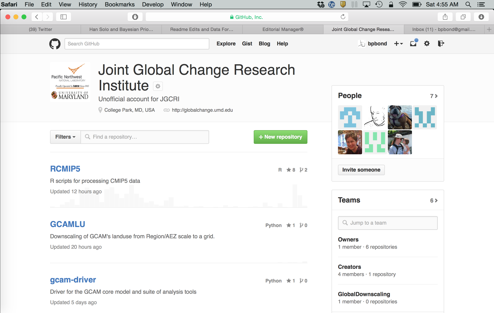

Working with data in R
========================================================
author: Ben Bond-Lamberty
date: June 2015

A JGCRI workshop covering reproducibility, tools, importing, manipulation and aggregation, piping, handling errors, speed (profiling, parallelization), and common use cases.

Three hours, 50% lecture and 50% working examples and problems.

Focus of this workshop
========================================================

(TODO: data pipeline graphic)

Raw data -> process -> summarize -> analyze/plot/output

Typically:
- *Process* includes cleaning, filtering, reshaping, modifying, QC
- *Summarize* includes applying functions, merging with ancillary data


Is R the right tool for the job?
========================================================

>R has simple and obvious appeal. Through R, you can sift through complex data sets, manipulate data through sophisticated modeling functions, and create sleek graphics to represent the numbers, in just a few lines of code...
>
>R’s greatest asset is the vibrant ecosystem has developed around it: The R community is constantly adding new packages and features to its already rich function sets. It’s estimated that more than 2 million people use R, and a recent poll showed that R is by far the most popular language in data science

From [The 9 Best Languages For Crunching Data](http://www.fastcompany.com/3030716/the-9-best-languages-for-crunching-data)


Is R the right tool for the job?
========================================================

But it might not be. R has limitations and weaknesses.
- learning curve; quirks; inconsistent syntax
- documentation patchy and terse
- package quality varies
- generally operates in-memory only
- not particularly fast

Alternative to address some of these issues include C/C++ (speed), Python (intuitive, flexible, scalable), Julia (fast, expressive, arcane), Java (scalable), Hadoop (very large data).


Things you should know
========================================================
type: section


Things you should know: basics
========================================================

This workshop assumes you understand the basics of using **`R`**:

- What it is
- How to start it
- The idea of *objects*, *functions*, *assignment*, and *comments*

```r
x <- 10
sum(x) # `sum` is a built-in function
```

```
[1] 10
```


Things you should know: data
========================================================

- The *boolean* (`TRUE`, `FALSE`) data type
- The *vector* data type

```r
v <- 1:5
v
```

```
[1] 1 2 3 4 5
```

```r
v*2
```

```
[1]  2  4  6  8 10
```

```r
c(sum(v), rev(v))  # concatenate
```

```
[1] 15  5  4  3  2  1
```


Things you should know: data
========================================================

- The idea of a *data frame* (tightly coupled vectors)

```r
head(cars)  # a built-in dataset
```

```
  speed dist
1     4    2
2     4   10
3     7    4
4     7   22
5     8   16
6     9   10
```

Data frames are the fundamental (in the sense of most frequently used) data type in R.


Things you should know: data
========================================================

- How to *list* and *remove* objects

```r
ls()
```

```
[1] "v" "x"
```

```r
rm(x)
ls()
```

```
[1] "v"
```


Things you should know: control flow
========================================================

- Most common control flow uses `if...then...else` and `for`

```r
if(sum(1:4) == 10) {
  print("right!")
} else {
  print("wrong!")
}
```

```
[1] "right!"
```

```r
for(i in 1:4) { cat(i) }
```

```
1234
```


Things you should know: packages
========================================================

- *Packages* are pieces of software that can be optionally loaded and used in R. The R package system is one of the language's enormous strengths: there are thousands, written for all kinds of tasks and needs.


```r
library(ggplot2)
qplot(speed, dist, data=cars)
```

***

 


Quiz: Basics
========================================================
type: prompt
incremental: true


```r
x <- -2:2
x ** 2  # what does this print?
```

```
[1] 4 1 0 1 4
```

```r
y <- x < 0  # what type is y?
y
```

```
[1]  TRUE  TRUE FALSE FALSE FALSE
```

***


```r
x[1:2] # ?
```

```
[1] -2 -1
```

```r
data.frame(x=x, y=y)
```

```
   x     y
1 -2  TRUE
2 -1  TRUE
3  0 FALSE
4  1 FALSE
5  2 FALSE
```


Reproducibility
========================================================
type: section


Reproducibility
========================================================

We are in the era of 'big data', but even if you work with 'little data' you have to acquire some skills to deal with those data.

**Most fundamentally, your results have to be reproducible.**

**Reproducible by yourself, and others.**

**At any time in the future.**


You can't reproduce
========================================================
...what doesn't exist.
- Gozilla ate my computer
    + backup
    + ideally *continuous*
- Godzilla ate my office
    + cloud

***


You can't reproduce
========================================================

...what you've lost. What if you need access to a file as it existed 1, 10, or 100, or 1000 days ago?
- Incremental backups
    + [Time Machine](http://www.apple.com/support/timemachine/)
    + [Dropbox](https://www.dropbox.com)
    + Many other solutions
- Version control

***


Version control
========================================================

**Git** and **GitHub** are the most popular (and free) version control tools for use with R (and many other languages):
- version control
- sharing code with collaborators
- issue tracking
- social coding

***



**JGCRI has a paid GitHub account: private repositories.**


Packages and reproducibility
========================================================

Using *packages* raises an interesting problem though, as the packages may themselves
change over time (version 1.0, 1.1, ...). How can you guarantee that your script's
behavior and results won't change?

There are a number of solutions to this problem, but my favorite lightweight one is the [checkpoint](http://cran.r-project.org/web/packages/checkpoint/index.html) package.


```r
library(checkpoint)
checkpoint("2015-06-20")
```

This will automatically load and install your script's packages *exactly as they existed on a particular date in the past*.


Code style and clarity
========================================================

Use a clear, consistent code style. Many examples are available.

Be clear in your code.


```r
finaldata <- plot(merge(process(read.csv( "rawdata.csv")), otherdata))
```


```r
finaldata <- read.csv("rawdata.csv") %>%
  process() %>%
  merge(otherdata) %>%
  plot()
```


Reproducible research example
========================================================

A typical project/paper directory for me:
```
0-rawdata.R
1-process_data.R
2-analyze_data.R
3-make_graphs.R
logs/
output/
rawdata/
```

This directory is generated by my [default script](https://github.com/bpbond/R_analysis_script). It is backed up both *locally* and *remotely*, and under *version control*.


Reproducible research example
========================================================

- Sequentially numbered R scripts
    + (0-download.R, 1-process_data.R, ...)
- Each script depends on the previous one
- Each has a discrete, logical function
- Each produces a *log file*
    + including date/time, what R version, etc.
- This analytical chain starts with raw data
- ...and ends with figures and tables for ms
    + *or the ms itself!*


Getting data into R
========================================================
type: section


Things to install beforehand
========================================================
If you're doing the exercises and problems, you should have installed these
packages beforehand:
- `dplyr` - fast, flexible tool for working with data frames
- `plyr` - tools for splitting, applying and combining data
- `reshape2` and `tidyr` - reshaping and tidying data

We'll also use these *data packages*:
- `babynames` - names provide to the SSA 1880-2013
- `nycflights13` - 336,776 flights that departed NYC in 2013

These can all be installed using R's `install.packages` command.


Getting data the way you want it
========================================================
type: section


History lesson
========================================================

graphic w/ R, data.table, plyr, dplyr, reshape, reshape2, tidyr


Summarizing and operating on data
========================================================
type: section


Robustness and performance
========================================================
type: section


Links and references
========================================================
type: section


The true power of R
========================================================

R also has many contributed *packages* across a wide variety of scientific fields. Almost anything you want to do will have packages to support it.

[CRAN](http://cran.r-project.org) also provides "Task Views". For example:

***

- Bayesian
- Clinical Trials
- Differential Equations
- Finance
- Genetics
- HPC
- Meta-analysis
- Optimization
- [**Reproducible Research**](http://cran.r-project.org/web/views/ReproducibleResearch.html)
- Spatial Statistics
- Time Series
