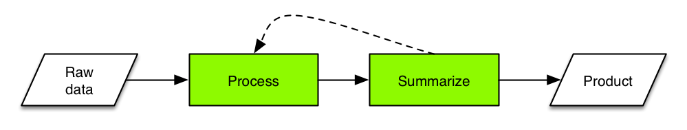

Working with data in R
========================================================
author: Ben Bond-Lamberty
date: June 2015

A JGCRI workshop covering reproducibility, tools, importing, manipulation and aggregation, piping, handling errors, speed (profiling, parallelization), and common use cases.

Three hours, 50% lecture and 50% working examples and problems.


Focus of this workshop
========================================================



In a typical data pipline:
- *Raw data* can come from many sources 
- *Processing* includes cleaning, filtering, reshaping, modifying, QC
- *Summarizing* includes applying functions, merging with ancillary data, computing group summaries
- *Products* include output data, plots, statistical analyses


Is R the right tool for the job?
========================================================

>R has simple and obvious appeal. Through R, you can sift through complex data sets, manipulate data through sophisticated modeling functions, and create sleek graphics to represent the numbers, in just a few lines of code...
>
>R’s greatest asset is the vibrant ecosystem has developed around it: The R community is constantly adding new packages and features to its already rich function sets. It’s estimated that more than 2 million people use R...

From [The 9 Best Languages For Crunching Data](http://www.fastcompany.com/3030716/the-9-best-languages-for-crunching-data)


Is R the right tool for the job?
========================================================

It might not be. R has limitations and weaknesses:
- learning curve; quirks; inconsistent syntax
- documentation patchy and terse
- package quality varies
- generally operates in-memory only
- not particularly fast

Alternative to address some of these issues include C/C++ (speed), Python (intuitive, flexible, scalable), Julia (fast, expressive, arcane), Java (scalable), Hadoop (very large data).


Things you should know
========================================================
type: section


Things you should know: basics
========================================================

This workshop assumes you understand the basics of using R:

- What it is
- How to start it
- The idea of *objects*, *functions*, *assignment*, and *comments*

```r
x <- 10
sum(x) # `sum` is a built-in function
```

```
[1] 10
```
- How to get help: for example `?read.table`

Things you should know: data
========================================================

- The *boolean* (`TRUE`, `FALSE`) data type
- The *vector* data type

```r
v <- 1:5
v
```

```
[1] 1 2 3 4 5
```

```r
v*2
```

```
[1]  2  4  6  8 10
```

```r
c(sum(v), rev(v))  # concatenate
```

```
[1] 15  5  4  3  2  1
```


Things you should know: data
========================================================

- The idea of a *data frame* (tightly coupled vectors)

```r
head(cars)  # a built-in dataset
```

```
  speed dist
1     4    2
2     4   10
3     7    4
4     7   22
5     8   16
6     9   10
```
Data frames are the fundamental (in the sense of most frequently used) data type in R.


Things you should know: data
========================================================

- How to get information about a data frame

```r
nrow(cars)
```

```
[1] 50
```

```r
summary(cars)
```

```
     speed           dist       
 Min.   : 4.0   Min.   :  2.00  
 1st Qu.:12.0   1st Qu.: 26.00  
 Median :15.0   Median : 36.00  
 Mean   :15.4   Mean   : 42.98  
 3rd Qu.:19.0   3rd Qu.: 56.00  
 Max.   :25.0   Max.   :120.00  
```


Things you should know: data
========================================================

- Basic data frame indexing

```r
cars[1,]
```

```
  speed dist
1     4    2
```

```r
cars[c(1, 3:4),]
```

```
  speed dist
1     4    2
3     7    4
4     7   22
```

***


```r
# Rows and columns can be specified by number or name.
cars[3, "dist"]
```

```
[1] 4
```


Things you should know: data
========================================================

- How to *list* and *remove* objects

```r
ls()
```

```
[1] "v" "x"
```

```r
rm(x)
ls()
```

```
[1] "v"
```


Things you should know: control flow
========================================================

- Most common control flow uses `if...then...else` and `for`

```r
if(sum(1:4) == 10) {
  print("right!")
} else {
  print("wrong!")
}
```

```
[1] "right!"
```

```r
for(i in 1:4) { cat(i) }
```

```
1234
```


Things you should know: control flow
========================================================

The difference between a *script* and *command line*.

In general, you want to use scripts.


Things you should know: packages
========================================================

- *Packages* are pieces of software that can be optionally loaded and used. The package system is one of R's enormous strengths: there are thousands, written for all kinds of tasks and needs.


```r
library(ggplot2)
qplot(speed, dist, data=cars)
```

***

 


Quiz: Basics
========================================================
type: prompt
incremental: true


```r
x <- -2:2
x ** 2  # what does this print?
```

```
[1] 4 1 0 1 4
```

```r
y <- x < 0  # what type is y?
y
```

```
[1]  TRUE  TRUE FALSE FALSE FALSE
```

***


```r
x[-1] # ?
```

```
[1] -1  0  1  2
```

```r
data.frame(x=x, y=y)
```

```
   x     y
1 -2  TRUE
2 -1  TRUE
3  0 FALSE
4  1 FALSE
5  2 FALSE
```


Reproducibility
========================================================
type: section


Reproducibility
========================================================

We are in the era of 'big data', but even if you work with 'little data' you have to acquire some skills to deal with those data.

**Most fundamentally, your results have to be reproducible.**

**Reproducible by yourself, and others.**

**At any time in the future.**


You can't reproduce
========================================================
...what doesn't exist.
- Gozilla ate my computer
    + backup
    + ideally *continuous*
- Godzilla ate my office
    + cloud

***


You can't reproduce
========================================================

...what you've lost. What if you need access to a file as it existed 1, 10, or 100, or 1000 days ago?
- Incremental backups
    - minimum
- Version control
    - better

***


Version control
========================================================

**Git** and **GitHub** are the most popular (and free) version control tools for use with R, and many other languages:
- version control
- sharing code with collaborators
- issue tracking
- social coding

***


**JGCRI has a paid GitHub account: private repositories.**


Packages and reproducibility
========================================================

Using *packages* raises an interesting problem though, as the packages may themselves
change over time (version 1.0, 1.1, ...). How can you guarantee that your script's
behavior and results won't change?

There are a number of solutions to this problem, but my favorite lightweight one is the [checkpoint](http://cran.r-project.org/web/packages/checkpoint/index.html) package.


```r
library(checkpoint)
checkpoint("2015-06-20")
```

This will automatically load and install your script's packages *exactly as they existed on a particular date in the past*.


Code style and clarity
========================================================

Use a clear, consistent code style. Many examples are available.

Be clear in your code.


```r
finaldata <- plot(merge(process(read.csv( "rawdata.csv")), otherdata))
```


```r
finaldata <- read.csv("rawdata.csv") %>%
  process() %>%
  merge(otherdata) %>%
  plot()
```


Reproducible research example
========================================================

A typical project/paper directory for me:
```
0-download.R
1-process_data.R
2-analyze_data.R
3-make_graphs.R
logs/
output/
rawdata/
```

This directory is generated by my [default script](https://github.com/bpbond/R_analysis_script). It is backed up both *locally* and *remotely*, and under *version control*.


Reproducible research example
========================================================

- Sequentially numbered R scripts
    + (0-download.R, 1-process_data.R, ...)
- Each script depends on the previous one
- Each has a discrete, logical function
- Each produces a *log file*
    + including date/time, what R version, etc.
- This analytical chain starts with raw data
- ...and ends with figures and tables for ms
    + *or the ms itself!*


Getting data into R
========================================================
type: section


Things to install beforehand
========================================================
If you're doing the exercises and problems, you should have installed these
packages beforehand:
- `dplyr` - fast, flexible tool for working with data frames
- `plyr` - tools for splitting, applying and combining data
- `reshape2` and `tidyr` - reshaping and tidying data

We'll also use these *data packages*:
- `babynames` - names provide to the SSA 1880-2013
- `nycflights13` - 336,776 flights that departed NYC in 2013

These can all be installed using R's `install.packages` command.


Getting data into R
========================================================

By far the most common way to bring data into R is via the `read.table` family of functions. In particular, `read.csv` reads a comma separated value file.

```r
d <- read.table("mydata.csv", sep=",", header=TRUE)
d <- read.csv("mydata.csv") # same thing
```


Getting data into R
========================================================

Common and useful options to `read.table` and its brethren include:

Option        | Effect
------------- | -------------
skip=*n*      | Skip the first *n* lines of the file
nrows=*n*     | Read *n* rows of data
sep=*s*       | Look for character *s* separating data
comment.char=*c*  | Lines beginning with *c* are ignored
header=TRUE  | Look for a header giving column names
check.names=TRUE | Check that column names are syntactically correct


Gotcha #1: stringsAsFactors
========================================================
type: alert

The behavior of `read.table` leads to an **extremely common** bug for beginners in R.

By default, `read.table` changes strings to `factors`: a number encoding categories (e.g. 0, 1, 2 instead of "Apple", "Banana", "Grape"). This can lead to hard-to-diagnose problems later if you're not expecting it.

The solution:

```r
d <- read.csv("mydata.csv", stringsAsFactors=FALSE)
```


Getting data into R
========================================================

`read.table` can also read from data you've copied from another program, from a string, from a compressed file, or from an URL.

Let's use this ability to read in a dataset, from Pew Research's [Religious Landscape Survey](http://www.pewforum.org/religious-landscape-study/). These particular data examine the relationship between income and religious affiliation.

***


Exercise: Reading data into R
========================================================
type: prompt
incremental: true

Data are at: http://stat405.had.co.nz/data/pew.txt


```r
pew <- read.table(...)
pew
summary(pew)
```

Don't forget to look at the help page!


```r
pew <- read.table(
  file = "http://stat405.had.co.nz/data/pew.txt",
  header = TRUE,
  stringsAsFactors = FALSE,
  check.names = FALSE
)
```


Alternatives for getting data into R
========================================================

The `read.table` family of functions can be slow and (generally) only read from flat text files. But there are *many* other options.
- A number of packages read Excel files directly. In particular the new `readxl` is fast, stable, and flexible
- `data.table::fread` reads text files extremely quickly, as does the new `readr` package
- The `foreign` package provides import facilities for Stat, SAS, Minitab, etc.
- Relational databases via ` RMySQL` and others
- Many specialized packages (e.g. `ncdf4` for netCDF)


Cleaning data
========================================================
type: section


Examining data frames
========================================================

In most cases, after you've imported your data, it's in a `data.frame`. What now? Generally we'd like to look at it in various ways. The *generic* function `summary` is useful:

```r
summary(cars)
```

```
     speed           dist       
 Min.   : 4.0   Min.   :  2.00  
 1st Qu.:12.0   1st Qu.: 26.00  
 Median :15.0   Median : 36.00  
 Mean   :15.4   Mean   : 42.98  
 3rd Qu.:19.0   3rd Qu.: 56.00  
 Max.   :25.0   Max.   :120.00  
```


Examining data frames
========================================================


```r
nrow(cars)
```

```
[1] 50
```

```r
head(cars)
```

```
  speed dist
1     4    2
2     4   10
3     7    4
4     7   22
5     8   16
6     9   10
```

***


```r
ncol(cars)
```

```
[1] 2
```

```r
tail(cars)
```

```
   speed dist
45    23   54
46    24   70
47    24   92
48    24   93
49    24  120
50    25   85
```


Examining data frames
========================================================

For very large data frames, you might want to take a random sample of the rows to be able to plot or get a sense of things.

```r
library(babynames) # has 1,792,091 rows
babynames[sample(nrow(babynames), 3), ]
```

```
        year sex    name  n         prop
1291048 1998   F    Ilyn  5 2.580798e-06
507259  1954   F   Lesly 14 7.032805e-06
1520955 2006   F Michell 89 4.263212e-05
```
This uses the extremely useful function `sample` to randomly sample from a vector.


Examining data frames
========================================================


```r
names(cars)
```

```
[1] "speed" "dist" 
```

```r
unique(cars$speed)
```

```
 [1]  4  7  8  9 10 11 12 13 14 15 16 17 18 19 20 22 23 24 25
```

***


```r
range(cars$dist)
```

```
[1]   2 120
```


Subsetting data frames
========================================================

There are (at least) two separate ways to subset data in base R.


```r
cars[cars$speed < 8,]
```

```
  speed dist
1     4    2
2     4   10
3     7    4
4     7   22
```

***


```r
subset(cars, speed < 8)
```

```
  speed dist
1     4    2
2     4   10
3     7    4
4     7   22
```
There can be subtle differences but you can generally consider these to be equivalent.


Subsetting data frames
========================================================

Data frames are indexed by row *first* and column *second* (in the more general case of multidimensional arrays, the other dimensions follow).

```r
cars[1, ]
```

```
  speed dist
1     4    2
```

***


```r
cars[1:3, ]
```

```
  speed dist
1     4    2
2     4   10
3     7    4
```

Negative notation excludes!


```r
cars[2, -1] 
```

```
[1] 10
```


Subsetting data frames
========================================================

Finding and removing duplicates. Note the use of `which`.

```r
any(duplicated(cars$dist))
```

```
[1] TRUE
```

```r
dupes <- which(duplicated(cars$dist))
print(dupes)
```

```
 [1]  6 15 16 17 18 20 24 25 29 30 36 37 39 42 45
```

```r
cars_nodupes <- cars[-dupes, ]
```


Examining data frames
========================================================


```r
plot(cars$speed, cars$dist, main="We are NOT covering plotting!")
```

 


Exercise: Examining data frames
========================================================
type: prompt


```r
library(babynames)
summary(babynames)
```

How many rows and columns are there in the `babynames` dataset?

What name is in row #12345?

How many unique baby names are there?

Make a new data frame with a random 1% of the original rows.

How many 19th century rows are there?


Exercise: Examining data frames
========================================================
type: prompt


```r
library(babynames)
cat(nrow(babynames), ncol(babynames), babynames[12345, "name"])
```

```
1792091 5 Baxter
```

```r
s <- babynames[sample(1:nrow(babynames), 0.01 * nrow(babynames)),]
nrow(subset(babynames, year < 1900))
```

```
[1] 52265
```


Cleaning data
========================================================

Usually, the first thing you'd like to do after importing data is *clean* it.

- change column types
- computing on columns
- splitting columns
- combining columns
- dealing with `NA` values


Changing column types
========================================================

Often, the default classes assigned by `read.table` and its ilk aren't correct. You can change these--but first, make sure to understand *why* `read.table` did what it did.

```r
d$x <- as.numeric(d$x)
d$y <- as.character(d$y)
d$z <- as.Date(d$z)
d$z <- as.factor(d$x)
```


Computing on columns
========================================================

This can be trivial....

```r
d <- data.frame(x=1:3)
d$y <- d$x * 2
d$z <- cumsum(d$y)
d$four <- ifelse(d$y == 4, "four", "not four") 
d
```

```
  x y  z     four
1 1 2  2 not four
2 2 4  6     four
3 3 6 12 not four
```


Computing on columns
========================================================

...but not always. A rolling mean. TODO.


Gotcha #2: length() and for()
========================================================
type: alert

On the previous slide, we used `seq_along(d)` instead of `1:nrow(d)`. Why?

Because if `d` has zero rows, we get undesirable behavior.


```r
d <- data.frame()  # 0 rows
for(i in 1:nrow(d)) print(i)
```

```
[1] 1
[1] 0
```

```r
for(i in seq_along(d)) print(i)
```


Computing on columns
========================================================
TODO: make this into an exercise
...but not always. Here we have valve numbers (attached to a CO2 analyer), and need to know whenever the numbers change to a new sample so we can assign a sample number.

```r
valvenums <- c(1, 1, 2, 3, 3, 3, 1, 2, 2, 3)
newvalveflag <- c(TRUE, valvenums[-length(valvenums)] != valvenums[-1])
print(newvalveflag)
```

```
 [1]  TRUE FALSE  TRUE  TRUE FALSE FALSE  TRUE  TRUE FALSE  TRUE
```

```r
print(cumsum(newvalveflag))
```

```
 [1] 1 1 2 3 3 3 4 5 5 6
```


Combining columns
========================================================

Combining columns is generally easy.

```r
d <- data.frame(x=1:3, y=4:6)
d$z <- with(d, paste("pasted", x, "and", y))  # note use of `with` here
d
```

```
  x y              z
1 1 4 pasted 1 and 4
2 2 5 pasted 2 and 5
3 3 6 pasted 3 and 6
```


Splitting columns
========================================================

This is sometimes a bit trickier. Perfectly possible in base R, but since we'll be using the `reshape2` package later anyway, let's use `reshape2::colsplit`.

```r
d <- data.frame(x=paste("hi", 1:3))
library(reshape2)
split <- colsplit(d$x, " ", c("var1", "var2"))
cbind(d, split)
```

```
     x var1 var2
1 hi 1   hi    1
2 hi 2   hi    2
3 hi 3   hi    3
```


Understanding and dealing with NA
========================================================


Dealing with dates
========================================================

R has a `Date` class representing calendar dates, and an `as.Date` function for converting to Dates. The `lubridate` package is often useful (and easier) for these cases:

```r
library(lubridate)
x <- c("09-01-01", "09-01-02")
ymd(x)   # there's also dmy and mdy!
```

```
[1] "2009-01-01 UTC" "2009-01-02 UTC"
```

The `difftime` function is useful for computing time intervals.


Reshaping data
========================================================
type: section


History lesson
========================================================


Reshaping data
========================================================

Generlly this is **critical** step.

- rbind, cbind, merge
- long versus wide data - very important!


Exercise: Reshaping data
========================================================
type: prompt
incremental: true

?


Summarizing and operating on data
========================================================
type: section


Robustness and performance
========================================================
type: section


Resources
========================================================
type: section


Resources
========================================================

Rstudio, rkward on KDE, RCommander, etc.


Resources
========================================================

R also has many contributed *packages* across a wide variety of scientific fields. Almost anything you want to do will have packages to support it.

[CRAN](http://cran.r-project.org) also provides "Task Views". For example:

***

- Bayesian
- Clinical Trials
- Differential Equations
- Finance
- Genetics
- HPC
- Meta-analysis
- Optimization
- [**Reproducible Research**](http://cran.r-project.org/web/views/ReproducibleResearch.html)
- Spatial Statistics
- Time Series

Exercises (10 minutes each):
Importing data
Manipulating/subset/index
Melt/cast
Summarizing

Gotcha list to include:
stringsAsFactors
When using a sequence as an index for iteration, it's better to use the seq_along() function rather than something like 1:length(x).
1-based indexing
List notation
Partial matching in the $ operator: This applies to lists, but also on data.frame


