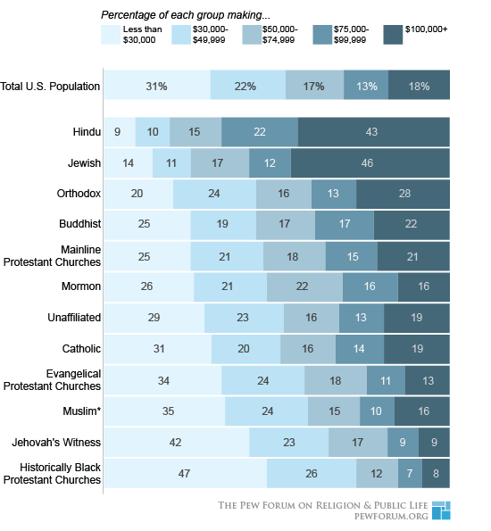

Working with data in R
========================================================
author: Ben Bond-Lamberty
date: June 2015

A JGCRI workshop covering reproducibility, tools, importing, manipulation and aggregation, piping, handling errors, speed (profiling, parallelization), and common use cases.

Three hours, 50% lecture and 50% working examples and problems.

Feedback: <a href="mailto:bondlamberty@pnnl">Email</a>  [Twitter](https://twitter.com/BenBondLamberty)


Three hours of action & entertainment
========================================================

- Introduction and reproducibility (20 minutes)
- Getting data into R (20 minutes)
- Cleaning data (20 minutes)
- Reshaping data (30 minutes)

(break)

- Summarizing data (45 minutes)
- Robustness and performance (30 minutes)

**Breadth more than depth**


Focus of this workshop
========================================================


In a typical data pipline:
- *Raw data* can come from many sources 
- *Processing* includes cleaning, filtering, reshaping, modifying, QC
- *Summarizing* includes applying functions, merging with ancillary data, computing group summaries
- *Products* include output data, plots, statistical analyses


Is R the right tool for the job?
========================================================

>R has simple and obvious appeal. Through R, you can sift through complex data sets, manipulate data through sophisticated modeling functions, and create sleek graphics to represent the numbers, in just a few lines of code...
>
>R’s greatest asset is the vibrant ecosystem has developed around it: The R community is constantly adding new packages and features to its already rich function sets. It’s estimated that more than 2 million people use R...

From [The 9 Best Languages For Crunching Data](http://www.fastcompany.com/3030716/the-9-best-languages-for-crunching-data)


Is R the right tool for the job?
========================================================

It might not be. R has limitations and weaknesses:
- nontrivial learning curve; quirks; inconsistent syntax
- documentation patchy and terse
- package quality varies
- generally operates in-memory only
- not particularly fast

Alternatives to address some of these issues include C/C++ (speed), Python (intuitive, flexible, scalable), Julia (fast, expressive, arcane), Java (scalable), Hadoop (very large data).


Things you should know
========================================================
type: section


Things you should know: basics
========================================================

This workshop assumes you understand the basics of using R:

- What R is
- How to start and quit it
- How to get help
  + `?read.table`
  + `help(package='dplyr')`


Things you should know: basics
========================================================

- The idea of *objects*, *functions*, *assignment*, and *comments*

```r
x <- 10 # `x` is an object
sum(x) # `sum` is a function
```

>To understand computations in R, two slogans are helpful:
>- Everything that exists is an object.
>- Everything that happens is a function call.
>
>(John Chambers)


Things you should know: data types
========================================================

- The *boolean* (`TRUE`, `FALSE`) data type
- The *vector* data type

```r
v <- 1:5 + 1
cat(v, v*2)
```

```
2 3 4 5 6 4 6 8 10 12
```

```r
v[c(2, 5)]
```

```
[1] 3 6
```


Things you should know: data types
========================================================

- The *factor* data type

```r
summary(letters)
```

```
   Length     Class      Mode 
       26 character character 
```

```r
summary(as.factor(letters))
```

```
a b c d e f g h i j k l m n o p q r s t u v w x y z 
1 1 1 1 1 1 1 1 1 1 1 1 1 1 1 1 1 1 1 1 1 1 1 1 1 1 
```


Things you should know: data frames
========================================================

- The idea of a *data frame* (tightly coupled vectors)

```r
head(cars)  # a built-in dataset
```

```
  speed dist
1     4    2
2     4   10
3     7    4
4     7   22
5     8   16
6     9   10
```
Data frames are the fundamental (in the sense of most frequently used) data type in R.


Things you should know: data frames
========================================================

- How to get information about a data frame

```r
nrow(cars)
```

```
[1] 50
```

```r
summary(cars)
```

```
     speed           dist       
 Min.   : 4.0   Min.   :  2.00  
 1st Qu.:12.0   1st Qu.: 26.00  
 Median :15.0   Median : 36.00  
 Mean   :15.4   Mean   : 42.98  
 3rd Qu.:19.0   3rd Qu.: 56.00  
 Max.   :25.0   Max.   :120.00  
```


Things you should know: data frames
========================================================

- Basic data frame indexing

```r
cars[1,]
```

```
  speed dist
1     4    2
```

```r
cars[c(1, 3:4),]
```

```
  speed dist
1     4    2
3     7    4
4     7   22
```

***


```r
# Rows and columns can be specified by number or name.
cars[3, "dist"]
```

```
[1] 4
```

```r
cars$dist[3]
```

```
[1] 4
```


Gotcha #1: partial matching
========================================================
type: alert

R has *partial matching* for the $ operator.


```r
d <- data.frame(xdsfjk=1:3)
d$x
```

```
[1] 1 2 3
```

In particular, you need to be careful using any `x`, or checking for `is.null(x)`, if another column exists whose name begins with the same pattern.

This applies to both data frames and lists.


Things you should know: control flow
========================================================

- Most common control flow uses `if...then...else` and `for`

```r
if(sum(1:4) == 10) {
  print("right!")
} else {
  print("wrong!")
}
```

```
[1] "right!"
```

```r
for(i in 1:4) { cat(i) }
```

```
1234
```


Things you should know: control flow
========================================================

The difference between a *script* and *command line*.

In general, you want to use scripts.


Things you should know: packages
========================================================

- *Packages* are pieces of software that can be optionally loaded and used. The package system is one of R's enormous strengths: there are thousands, written for all kinds of tasks and needs.


```r
library(ggplot2)
qplot(speed, dist, data=cars)
```

***

 


Quiz: Basics
========================================================
type: prompt
incremental: true


```r
x <- -2:2
x ** 2  # what does this print?
```

```
[1] 4 1 0 1 4
```

```r
y <- x < 0  # what type is y?
y
```

```
[1]  TRUE  TRUE FALSE FALSE FALSE
```

***


```r
x[-1] # ?
```

```
[1] -1  0  1  2
```

```r
data.frame(x=x, y=y)
```

```
   x     y
1 -2  TRUE
2 -1  TRUE
3  0 FALSE
4  1 FALSE
5  2 FALSE
```


Reproducibility
========================================================
type: section


Reproducibility
========================================================

We are in the era of 'big data', but even if you work with 'little data' you have to acquire some skills to deal with those data.

**Most fundamentally, your results have to be reproducible.**

**Reproducible by yourself, and others.**

**At any time in the future.**


You can't reproduce
========================================================
...what doesn't exist.
- Gozilla ate my computer
    + backup
    + ideally *continuous*
- Godzilla ate my office
    + cloud

***


You can't reproduce
========================================================

...what you've lost. What if you need access to a file as it existed 1, 10, or 100, or 1000 days ago?
- Incremental backups
    - minimum
- Version control
    - better

***


Version control
========================================================

**Git** and **GitHub** are the most popular (and free) version control tools for use with R, and many other languages:
- version control
- sharing code with collaborators
- issue tracking
- social coding

***


**JGCRI has a paid GitHub account: private repositories.**


Packages and reproducibility
========================================================

Using *packages* raises an interesting problem though, as the packages may themselves
change over time (version 1.0, 1.1, ...). How can you guarantee that your script's
behavior and results won't change?

There are a number of solutions to this problem, but my favorite lightweight one is the [checkpoint](http://cran.r-project.org/web/packages/checkpoint/index.html) package.


```r
library(checkpoint)
checkpoint("2015-06-20")
```

This will automatically load and install your script's packages *exactly as they existed on a particular date in the past*.


Code style and clarity
========================================================

Use a clear, consistent code style. Many examples are available.

Be clear in your code.


```r
finaldata <- plot(merge(process(read.csv( "rawdata.csv")), otherdata))
```


```r
finaldata <- read.csv("rawdata.csv") %>%
  process() %>%
  merge(otherdata) %>%
  plot()
```


Reproducible research example
========================================================

A typical project/paper directory for me:
```
0-download.R
1-process_data.R
2-analyze_data.R
3-make_graphs.R
logs/
output/
rawdata/
```

This directory is generated by my [default script](https://github.com/bpbond/R_analysis_script). It is backed up both *locally* and *remotely*, and under *version control*.


Reproducible research example
========================================================

- Sequentially numbered R scripts
    + (0-download.R, 1-process_data.R, ...)
- Each script depends on the previous one
- Each has a discrete, logical function
- Each produces a *log file*
    + including date/time, what R version, etc.
- This analytical chain starts with raw data
- ...and ends with figures and tables for ms
    + *or the ms itself!*


Getting data into R
========================================================
type: section


Things to install beforehand
========================================================
If you're doing the exercises and problems, you should have installed these
packages beforehand:
- `dplyr` - fast, flexible tool for working with data frames
- `plyr` - tools for splitting, applying and combining data
- `reshape2` - reshaping data

(These are part of what's known as the HadleyVerse.) We'll also use this *data package*:
- `babynames` - names provided to the SSA 1880-2013

These can all be installed using R's `install.packages` command.


Getting data into R
========================================================

By far the most common way to bring data into R is via the `read.table` family of functions. In particular, `read.csv` reads a comma separated value file.

```r
d <- read.table("mydata.csv", 
                sep=",", 
                header=TRUE)
d <- read.csv("mydata.csv") # same thing
```


Getting data into R
========================================================

Common and useful options to `read.table` and its brethren include:

Option        | Effect
------------- | -------------
skip=*n*      | Skip the first *n* lines of the file
nrows=*n*     | Read *n* rows of data
sep=*s*       | Look for character *s* separating data
comment.char=*c*  | Lines beginning with *c* are ignored
header=TRUE  | Look for a header giving column names
check.names=TRUE | Check that column names are syntactically correct


Gotcha #2: stringsAsFactors
========================================================
type: alert

The behavior of `read.table` leads to an **extremely common** bug for beginners in R.

By default, `read.table` changes strings to `factors`: a number encoding categories (e.g. 0, 1, 2 instead of "Apple", "Banana", "Grape"). This can lead to hard-to-diagnose problems later (for example, when merging data) if you're not expecting it.

The solution:

```r
d <- read.csv("mydata.csv",
              stringsAsFactors=FALSE)
```


Getting data into R
========================================================

`read.table` can also read from data you've copied from another program, from a string, from a compressed file, or from an URL.

Let's use this ability to read in a dataset, from Pew Research's [Religious Landscape Survey](http://www.pewforum.org/religious-landscape-study/). These particular data examine the relationship between income and religious affiliation.

***




Exercise: Reading data into R
========================================================
type: prompt
incremental: true

Data are at: http://stat405.had.co.nz/data/pew.txt


```r
pew <- read.table(...) # or...?
pew
summary(pew)
```

Don't forget to look at the help page!


```r
pew <- read.table(
  file = "http://stat405.had.co.nz/data/pew.txt",
  header = TRUE,
  stringsAsFactors = FALSE,
  check.names = FALSE
)
```


Alternatives for getting data into R
========================================================

The `read.table` family of functions can be slow and (generally) only reads from flat text files. But there are *many* other options.
- A number of packages read Excel files directly. In particular the new `readxl` is fast, stable, and flexible
- `data.table::fread` reads text files extremely quickly, as does the new `readr` package
- The `foreign` package provides import facilities for Stat, SAS, Minitab, etc.
- Relational databases via ` RMySQL` and others
- Many specialized packages (e.g. `ncdf4` for netCDF, `XML::readHTMLTable` for extracting tables from HTML)


Cleaning data
========================================================
type: section


Examining data frames
========================================================

In most cases, after you've imported your data, it's in a `data.frame`. The `summary` and `str` functions are useful for at this point:

```r
str(cars); summary(cars)
```

```
'data.frame':	50 obs. of  2 variables:
 $ speed: num  4 4 7 7 8 9 10 10 10 11 ...
 $ dist : num  2 10 4 22 16 10 18 26 34 17 ...
```

```
     speed           dist       
 Min.   : 4.0   Min.   :  2.00  
 1st Qu.:12.0   1st Qu.: 26.00  
 Median :15.0   Median : 36.00  
 Mean   :15.4   Mean   : 42.98  
 3rd Qu.:19.0   3rd Qu.: 56.00  
 Max.   :25.0   Max.   :120.00  
```

Examining data frames
========================================================


```r
nrow(cars)
```

```
[1] 50
```

```r
head(cars)
```

```
  speed dist
1     4    2
2     4   10
3     7    4
4     7   22
5     8   16
6     9   10
```

***


```r
ncol(cars)
```

```
[1] 2
```

```r
tail(cars)
```

```
   speed dist
45    23   54
46    24   70
47    24   92
48    24   93
49    24  120
50    25   85
```


Examining data frames
========================================================

For very large data frames, you might want to take a random sample of the rows to be able to plot or get a sense of things.

```r
library(babynames) # has 1,792,091 rows
babynames[sample(nrow(babynames), 3), ]
```

```
        year sex    name  n         prop
152332  1918   F Gladine  8 6.653570e-06
351479  1938   F    Otis  9 7.886028e-06
1762524 2013   F  Fannie 44 2.304624e-05
```
This uses the extremely useful function `sample` to randomly sample from a vector.


Examining data frames
========================================================


```r
names(cars)
```

```
[1] "speed" "dist" 
```

```r
unique(cars$speed)
```

```
 [1]  4  7  8  9 10 11 12 13 14 15 16 17 18 19 20 22 23 24 25
```

***


```r
range(cars$dist)
```

```
[1]   2 120
```


Subsetting data frames
========================================================

There are (at least) two separate ways to subset data in base R.


```r
cars[cars$speed < 8,]
```

```
  speed dist
1     4    2
2     4   10
3     7    4
4     7   22
```

***


```r
subset(cars, speed < 8)
```

```
  speed dist
1     4    2
2     4   10
3     7    4
4     7   22
```
There can be subtle differences but you can generally consider these to be equivalent.


Subsetting data frames
========================================================

Data frames are indexed by row *first* and column *second* (in the more general case of multidimensional arrays, the other dimensions follow).

```r
cars[1, ]
```

```
  speed dist
1     4    2
```

***


```r
cars[1:3, ]
```

```
  speed dist
1     4    2
2     4   10
3     7    4
```

Negative notation excludes!


```r
cars[2, -1] 
```

```
[1] 10
```


Subsetting data frames
========================================================

Finding and removing duplicates. Note the use of `which`.

```r
any(duplicated(cars$dist))
```

```
[1] TRUE
```

```r
dupes <- which(duplicated(cars$dist))
print(dupes)
```

```
 [1]  6 15 16 17 18 20 24 25 29 30 36 37 39 42 45
```

```r
cars_nodupes <- cars[-dupes, ]
```


Examining data frames
========================================================


```r
plot(cars$speed, cars$dist, main="We are NOT covering plotting!")
```

 


Exercise: Examining data frames
========================================================
type: prompt


```r
library(babynames)
summary(babynames)
```

How many rows and columns are there in the `babynames` dataset?

What name is in row #12345?

How many unique baby names are there?

Make a new data frame with a random 1% of the original rows.

How many 19th century rows are there?


Exercise: Examining data frames
========================================================
type: prompt
incremental: true


```r
library(babynames)
cat(nrow(babynames), ncol(babynames), babynames[12345, "name"])
```

```
1792091 5 Baxter
```

```r
s <- babynames[sample(1:nrow(babynames), 0.01 * nrow(babynames)),]

sum(babynames$year < 1900) # better than nrow(subset(...))
```

```
[1] 52265
```


Cleaning data
========================================================

Usually, the first thing you'd like to do after importing data is *clean* it.

- change column types
- computing on columns
- splitting columns
- combining columns
- dealing with `NA` values


Changing column types
========================================================

Often, the default classes assigned by `read.table` and its ilk aren't correct. You can change these--but first, make sure to understand *why* `read.table` did what it did.

```r
d$x <- as.numeric(d$x)
d$y <- as.character(d$y)
d$z <- as.Date(d$z)
d$z <- as.factor(d$x)
```
TODO


Computing on columns
========================================================

This can be simple...

```r
d <- data.frame(x=1:3)
d$y <- d$x * 2
d$z <- cumsum(d$y)
d$four <- ifelse(d$y == 4, "four", "not four") 
d
```

```
  x y  z     four
1 1 2  2 not four
2 2 4  6     four
3 3 6 12 not four
```

R provides a set of high performance functions for many of these tasks: `cumsum`, `cumprod`, `colMeans`, `colSums`, `rowMeans`, `rowSums`, etc.


Computing on columns
========================================================

...but not always. A rolling mean for window size *n*, for example.

* naive (slow) loop

```r
for(i in seq_along(x)) {
  # calculate mean...
```
* `filter` (note its `sides` argument)

```r
filter(x, rep(1/n, n), sides=2)
```

* package-specific solutions, e.g.

```r
zoo::rollmean(x, n, align='center')
```


Gotcha #3: sequences and for()
========================================================
type: alert
incremental: true

In the previous example, we used `seq_along(x)` instead of `1:length(x)` (or `nrow`). Why?

Because if `d` has zero rows or elements...


```r
d <- data.frame()  # 0 rows
for(i in 1:nrow(d)) print(i)
```

```
[1] 1
[1] 0
```

```r
for(i in seq_along(d))    # correct: no output
  print(i) 
```


Exercise: Computing on columns
========================================================
type: prompt
incremental: true

One recent problem I had involved a data frame with multiplexer valve numbers; in the experiment, the multiplexer was automatically switching between valves.

Whenever the valve number changes, we want to assign a new sample number.

```r
# analyzer is switching between valves 1, 2, and 3
vnums <- c(1, 1, 2, 3, 3, 3, 1, 2, 2, 3)
# there are 6 samples here: (1, 1), (2), (3, 3, 3), (1), (2, 2), (3)

# There are ≥ two solutions
# One is slow and functional, one fast and elegant
```


Exercise: Computing on columns
========================================================
type: prompt
incremental: true


```r
samplenums <- rep(1, length(vnums))
s <- 1
for(i in seq_along(vnums)[-1]) {
  if(vnums[i] != vnums[i-1])
    s <- s + 1
  samplenums[i] <- s
}
samplenums
```

```
 [1] 1 1 2 3 3 3 4 5 5 6
```


```r
newvalve <- c(TRUE, vnums[-length(vnums)] != vnums[-1])
cumsum(newvalve)
```

```
 [1] 1 1 2 3 3 3 4 5 5 6
```


Exercise: Computing on columns - time
========================================================
type: prompt


This has big consequences!

For a data frame with 1,100,000 rows:

In R, `for` loops are rarely the fastest way to do something (although they may be the clearest).

***

 


Combining columns
========================================================

Combining columns is generally easy.

```r
d <- data.frame(x=1:3, y=4:6)
d$z <- with(d, paste("pasted", x, "and", y))  # note use of `with` here
d
```

```
  x y              z
1 1 4 pasted 1 and 4
2 2 5 pasted 2 and 5
3 3 6 pasted 3 and 6
```


Splitting columns
========================================================

This is sometimes a bit trickier. Perfectly possible in base R, but since we'll be using the `reshape2` package later anyway, let's use `reshape2::colsplit`.

```r
d <- data.frame(x=paste("hi", 1:3))
library(reshape2)
split <- colsplit(d$x, " ", c("var1", "var2"))
cbind(d, split)
```

```
     x var1 var2
1 hi 1   hi    1
2 hi 2   hi    2
3 hi 3   hi    3
```


Understanding and dealing with NA
========================================================

One of R's real strengths is that missing values are a first-class data type: `NA`.


```r
x <- c(1, 2, 3, NA)
is.na(x) # returns c(F, F, F, T)
any(is.na(x)) # returns TRUE
```

Like `NaN` and `Inf`, usually `NA` 'poisons' operations, so must be handled.


```r
sum(x) # NA
sum(x, na.rm=TRUE) # 6
d <- data.frame(x)
na.omit(d)  # remove rows with NA
complete.cases(d)  # identify 'good' rows
```


Dealing with dates
========================================================

R has a `Date` class representing calendar dates, and an `as.Date` function for converting to Dates. The `lubridate` package is often useful (and easier) for these cases:

```r
library(lubridate)
x <- c("09-01-01", "09-01-02")
ymd(x)   # there's also dmy and mdy!
```

```
[1] "2009-01-01 UTC" "2009-01-02 UTC"
```

The `difftime` function is useful for computing time intervals.


Quiz: Cleaning Data
========================================================
type: prompt
incremental: true


```r
x <- -2:2
y <- 4/x 
y  # prints...?
```

```
[1]  -2  -4 Inf   4   2
```

```r
y <- y[is.finite(y)]
y  # prints...?
```

```
[1] -2 -4  4  2
```

***


```r
is.numeric(NA)
```

```
[1] FALSE
```

```r
is.numeric(Inf)
```

```
[1] TRUE
```

```r
is.infinite(Inf)
```

```
[1] TRUE
```


Reshaping data
========================================================
type: section


History lesson
========================================================


Reshaping data
========================================================

We often need data in a particular form for working with it.

If you're used to spreadsheets, it's more common to use data in *wide format*: a subject's repeated responses are in a single row.

For data processing in R, *long format* is almost always better: each row is one time point per subject.

Variables are one of two types: `id` variables, which are typically assigned; and `measure` variables, which are measured (observations). But it's not always obvious
- What is a variable?
- What is a unit of observation?
- Which data should go in each row?


Reshaping the Pew data
========================================================


```r
pew[1:5, 1:4]
```

```
            religion <$10k $10-20k $20-30k
1           Agnostic    27      34      60
2            Atheist    12      27      37
3           Buddhist    27      21      30
4           Catholic   418     617     732
5 Don’t know/refused    15      14      15
```

These data are *wide* - multiple observations per row.

Which columns are *measure* variables, and which *id* variables?


Reshaping the Pew data
========================================================


```r
library(reshape2)
pew_long <- melt(pew, id.vars="religion")
head(pew_long)
```

```
            religion variable value
1           Agnostic    <$10k    27
2            Atheist    <$10k    12
3           Buddhist    <$10k    27
4           Catholic    <$10k   418
5 Don’t know/refused    <$10k    15
6   Evangelical Prot    <$10k   575
```

These data are now *long*.

(I.e., `melt` has transformed them into 'molten' data.)


Reshaping the Pew data
========================================================

Once our data are *long*, we can cast into another form:


```r
pew_original <- dcast(pew_long, 
                      religion ~ variable)
all.equal(pew_original, pew)
```

```
[1] TRUE
```

We've just transformed it back into its orignial form!


```
           religion <$10k $10-20k $20-30k
           Agnostic    27      34      60
            Atheist    12      27      37
           Buddhist    27      21      30
           Catholic   418     617     732
 Don’t know/refused    15      14      15
```


Reshaping the Pew data
========================================================

Casting in the `reshape2` package can also involve data summarizing.


```r
dcast(pew_long, religion ~ .)
```

```
                  religion  .
1                 Agnostic 10
2                  Atheist 10
3                 Buddhist 10
4                 Catholic 10
5       Don’t know/refused 10
6         Evangelical Prot 10
7                    Hindu 10
8  Historically Black Prot 10
9        Jehovah's Witness 10
10                  Jewish 10
11           Mainline Prot 10
12                  Mormon 10
13                  Muslim 10
14                Orthodox 10
15         Other Christian 10
16            Other Faiths 10
17   Other World Religions 10
18            Unaffiliated 10
```


Reshaping the Pew data
========================================================

The aggregation function defaults to `length` but we can supply our own, as well as supply a value to use for missing combinations.


```r
reshape2::dcast(pew_long, religion ~ ., 
                fun.aggregate=mean)
```

```
                  religion     .
1                 Agnostic  82.6
2                  Atheist  51.5
3                 Buddhist  41.1
4                 Catholic 805.4
5       Don’t know/refused  27.2
6         Evangelical Prot 947.2
7                    Hindu  25.7
8  Historically Black Prot 199.5
9        Jehovah's Witness  21.5
10                  Jewish  68.2
11           Mainline Prot 747.0
12                  Mormon  58.1
13                  Muslim  11.6
14                Orthodox  36.3
15         Other Christian  12.9
16            Other Faiths  44.9
17   Other World Religions   4.2
18            Unaffiliated 370.7
```


Reshaping the Pew data
========================================================

Can have more than one `id` variable in your rows or columns.


```r
dcast(pew_long, religion + variable ~ ., mean)
```

```
                   religion           variable    .
1                  Agnostic              <$10k   27
2                  Agnostic            $10-20k   34
3                  Agnostic            $20-30k   60
4                  Agnostic            $30-40k   81
5                  Agnostic            $40-50k   76
6                  Agnostic            $50-75k  137
7                  Agnostic           $75-100k  122
8                  Agnostic          $100-150k  109
9                  Agnostic              >150k   84
10                 Agnostic Don't know/refused   96
11                  Atheist              <$10k   12
12                  Atheist            $10-20k   27
13                  Atheist            $20-30k   37
14                  Atheist            $30-40k   52
15                  Atheist            $40-50k   35
16                  Atheist            $50-75k   70
17                  Atheist           $75-100k   73
18                  Atheist          $100-150k   59
19                  Atheist              >150k   74
20                  Atheist Don't know/refused   76
21                 Buddhist              <$10k   27
22                 Buddhist            $10-20k   21
23                 Buddhist            $20-30k   30
24                 Buddhist            $30-40k   34
25                 Buddhist            $40-50k   33
26                 Buddhist            $50-75k   58
27                 Buddhist           $75-100k   62
28                 Buddhist          $100-150k   39
29                 Buddhist              >150k   53
30                 Buddhist Don't know/refused   54
31                 Catholic              <$10k  418
32                 Catholic            $10-20k  617
33                 Catholic            $20-30k  732
34                 Catholic            $30-40k  670
35                 Catholic            $40-50k  638
36                 Catholic            $50-75k 1116
37                 Catholic           $75-100k  949
38                 Catholic          $100-150k  792
39                 Catholic              >150k  633
40                 Catholic Don't know/refused 1489
41       Don’t know/refused              <$10k   15
42       Don’t know/refused            $10-20k   14
43       Don’t know/refused            $20-30k   15
44       Don’t know/refused            $30-40k   11
45       Don’t know/refused            $40-50k   10
46       Don’t know/refused            $50-75k   35
47       Don’t know/refused           $75-100k   21
48       Don’t know/refused          $100-150k   17
49       Don’t know/refused              >150k   18
50       Don’t know/refused Don't know/refused  116
51         Evangelical Prot              <$10k  575
52         Evangelical Prot            $10-20k  869
53         Evangelical Prot            $20-30k 1064
54         Evangelical Prot            $30-40k  982
55         Evangelical Prot            $40-50k  881
56         Evangelical Prot            $50-75k 1486
57         Evangelical Prot           $75-100k  949
58         Evangelical Prot          $100-150k  723
59         Evangelical Prot              >150k  414
60         Evangelical Prot Don't know/refused 1529
61                    Hindu              <$10k    1
62                    Hindu            $10-20k    9
63                    Hindu            $20-30k    7
64                    Hindu            $30-40k    9
65                    Hindu            $40-50k   11
66                    Hindu            $50-75k   34
67                    Hindu           $75-100k   47
68                    Hindu          $100-150k   48
69                    Hindu              >150k   54
70                    Hindu Don't know/refused   37
71  Historically Black Prot              <$10k  228
72  Historically Black Prot            $10-20k  244
73  Historically Black Prot            $20-30k  236
74  Historically Black Prot            $30-40k  238
75  Historically Black Prot            $40-50k  197
76  Historically Black Prot            $50-75k  223
77  Historically Black Prot           $75-100k  131
78  Historically Black Prot          $100-150k   81
79  Historically Black Prot              >150k   78
80  Historically Black Prot Don't know/refused  339
81        Jehovah's Witness              <$10k   20
82        Jehovah's Witness            $10-20k   27
83        Jehovah's Witness            $20-30k   24
84        Jehovah's Witness            $30-40k   24
85        Jehovah's Witness            $40-50k   21
86        Jehovah's Witness            $50-75k   30
87        Jehovah's Witness           $75-100k   15
88        Jehovah's Witness          $100-150k   11
89        Jehovah's Witness              >150k    6
90        Jehovah's Witness Don't know/refused   37
91                   Jewish              <$10k   19
92                   Jewish            $10-20k   19
93                   Jewish            $20-30k   25
94                   Jewish            $30-40k   25
95                   Jewish            $40-50k   30
96                   Jewish            $50-75k   95
97                   Jewish           $75-100k   69
98                   Jewish          $100-150k   87
99                   Jewish              >150k  151
100                  Jewish Don't know/refused  162
101           Mainline Prot              <$10k  289
102           Mainline Prot            $10-20k  495
103           Mainline Prot            $20-30k  619
104           Mainline Prot            $30-40k  655
105           Mainline Prot            $40-50k  651
106           Mainline Prot            $50-75k 1107
107           Mainline Prot           $75-100k  939
108           Mainline Prot          $100-150k  753
109           Mainline Prot              >150k  634
110           Mainline Prot Don't know/refused 1328
111                  Mormon              <$10k   29
112                  Mormon            $10-20k   40
113                  Mormon            $20-30k   48
114                  Mormon            $30-40k   51
115                  Mormon            $40-50k   56
116                  Mormon            $50-75k  112
117                  Mormon           $75-100k   85
118                  Mormon          $100-150k   49
119                  Mormon              >150k   42
120                  Mormon Don't know/refused   69
121                  Muslim              <$10k    6
122                  Muslim            $10-20k    7
123                  Muslim            $20-30k    9
124                  Muslim            $30-40k   10
125                  Muslim            $40-50k    9
126                  Muslim            $50-75k   23
127                  Muslim           $75-100k   16
128                  Muslim          $100-150k    8
129                  Muslim              >150k    6
130                  Muslim Don't know/refused   22
131                Orthodox              <$10k   13
132                Orthodox            $10-20k   17
133                Orthodox            $20-30k   23
134                Orthodox            $30-40k   32
135                Orthodox            $40-50k   32
136                Orthodox            $50-75k   47
137                Orthodox           $75-100k   38
138                Orthodox          $100-150k   42
139                Orthodox              >150k   46
140                Orthodox Don't know/refused   73
141         Other Christian              <$10k    9
142         Other Christian            $10-20k    7
143         Other Christian            $20-30k   11
144         Other Christian            $30-40k   13
145         Other Christian            $40-50k   13
146         Other Christian            $50-75k   14
147         Other Christian           $75-100k   18
148         Other Christian          $100-150k   14
149         Other Christian              >150k   12
150         Other Christian Don't know/refused   18
151            Other Faiths              <$10k   20
152            Other Faiths            $10-20k   33
153            Other Faiths            $20-30k   40
154            Other Faiths            $30-40k   46
155            Other Faiths            $40-50k   49
156            Other Faiths            $50-75k   63
157            Other Faiths           $75-100k   46
158            Other Faiths          $100-150k   40
159            Other Faiths              >150k   41
160            Other Faiths Don't know/refused   71
161   Other World Religions              <$10k    5
162   Other World Religions            $10-20k    2
163   Other World Religions            $20-30k    3
164   Other World Religions            $30-40k    4
165   Other World Religions            $40-50k    2
166   Other World Religions            $50-75k    7
167   Other World Religions           $75-100k    3
168   Other World Religions          $100-150k    4
169   Other World Religions              >150k    4
170   Other World Religions Don't know/refused    8
171            Unaffiliated              <$10k  217
172            Unaffiliated            $10-20k  299
173            Unaffiliated            $20-30k  374
174            Unaffiliated            $30-40k  365
175            Unaffiliated            $40-50k  341
176            Unaffiliated            $50-75k  528
177            Unaffiliated           $75-100k  407
178            Unaffiliated          $100-150k  321
179            Unaffiliated              >150k  258
180            Unaffiliated Don't know/refused  597
```


Exercise: Reshaping data
========================================================
type: prompt

The built-in (and very famous) `iris` dataset gives the measurements (in cm) of the variables sepal length and width and petal length and width, respectively, for 50 flowers from each of 3 species of iris. The species are *Iris setosa*, *versicolor*, and *virginica*.


```
  Sepal.Width Petal.Length Petal.Width Species
1         3.5          1.4         0.2  setosa
2         3.0          1.4         0.2  setosa
3         3.2          1.3         0.2  setosa
4         3.1          1.5         0.2  setosa
5         3.6          1.4         0.2  setosa
```

`iris` has 150 rows and 5 columns and is *wide*. Why?


Exercise: Reshaping data
========================================================
type: prompt

Use the `reshape2` package's `melt`, `colsplit`, `dcast` functions to make this nice summary table:

```
     Species PlantPart Length Width
1     setosa     Petal  1.462 0.246
2     setosa     Sepal  5.006 3.428
3 versicolor     Petal  4.260 1.326
4 versicolor     Sepal  5.936 2.770
5  virginica     Petal  5.552 2.026
6  virginica     Sepal  6.588 2.974
```

There is a tricky step when you use `colsplit`...


Exercise: Reshaping data
========================================================
type: prompt
incremental: true

Steps:

1. Think: what's the `id` variable(s)? What are the measured variable(s)?
2. Melt the `iris` data to long form.
3. Create new columns `PlantPart` and `Dimensions` by splitting apart the column containing "Sepal.length", etc.
4. Join these columns to the long data.
5. A single `dcast` call will create the summary table.

**The trick**: in step #3, you'll need to use `pattern="\\."`


Exercise: Reshaping data
========================================================
type: prompt


```r
# Step 2
# Notice that melt guesses the id var correctly
iris_long <- melt(iris)  

# Step 3
newcols <- colsplit(iris_long$variable, 
                    pattern="\\.", 
                    names=c("PlantPart","Dimension"))

# Step 4
iris_long <- cbind(iris_long, newcols)

# Step 5
dcast(iris_long, Species + PlantPart ~ Dimension, fun.aggregate = mean)
```


Summarizing and operating on data
========================================================
type: section


Summarizing and operating on data
========================================================

Intro - typical kinds of tasks


The apply family
========================================================

Traditionally the *apply* family of functions was R's solution. 

Function      | Description
------------- | ------------
base::apply   |  Apply Functions Over Array Margins
base::by      |  Apply a Function to a Data Frame Split by Factors
base::eapply  |  Apply a Function Over Values in an Environment
base::lapply  |  Apply a Function over a List or Vector
base::mapply  |  Apply a Function to Multiple List or Vector Arguments
base::rapply  |  Recursively Apply a Function to a List
base::tapply  |  Apply a Function Over a Ragged Array

This table is copied from https://nsaunders.wordpress.com/2010/08/20/a-brief-introduction-to-apply-in-r/, which provides a simple, readable summary of these functions.


Robustness and performance
========================================================
type: section


Resources
========================================================
type: section


Resources
========================================================

Rstudio, rkward on KDE, RCommander, etc.


Resources
========================================================

R also has many contributed *packages* across a wide variety of scientific fields. Almost anything you want to do will have packages to support it.

[CRAN](http://cran.r-project.org) also provides "Task Views". For example:

***

- Bayesian
- Clinical Trials
- Differential Equations
- Finance
- Genetics
- HPC
- Meta-analysis
- Optimization
- [**Reproducible Research**](http://cran.r-project.org/web/views/ReproducibleResearch.html)
- Spatial Statistics
- Time Series

Exercises (10 minutes each):
Importing data
Manipulating/subset/index
Melt/cast
Summarizing


Misc
========================================================

- `nycflights13` - 336,776 flights that departed NYC in 2013

plyr in one slide - 
dplyr

>The best thing about R is that it was written by statisticians. The worst thing about R is that it was written by statisticians.

(Bow Cowgill.)
